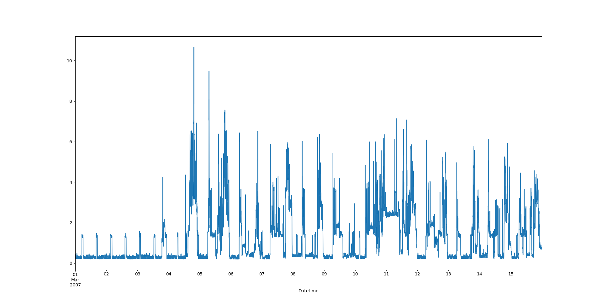
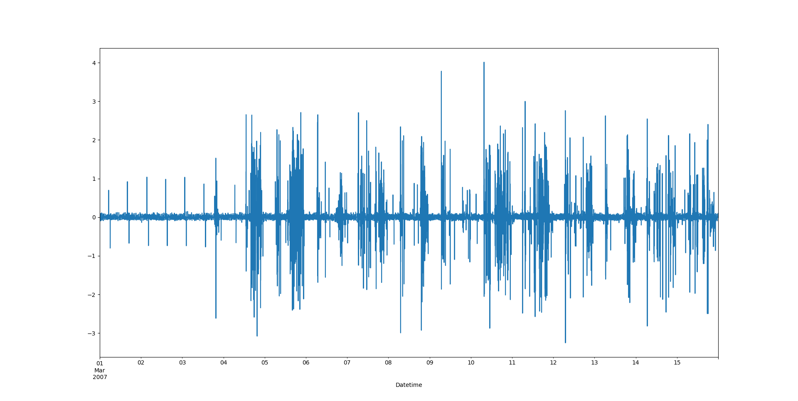

# Energy Anomaly Detection

Question : Est-il possible de détecter des anomalies dans une série temporelle de consommation électrique automatiquement à partir de modèles de marchine learning ?

Question subsidiaire : Est-il possible de différencier les anomalies des changements de régime (e.g. : consommation basse en période de vacance) ?

## Dataset

Les données sur lesquelles je travaille sont des données préparées par Georges Hebrail et Alice Berard datées entre 2006 et 2010 (DOI : [10.24432/C58K54](https://doi.org/10.24432/C58K54)). 
La base de donnée est composées d'un peu plus de 2 millions de données minutaires et se présente sous la forme suivante :

| Date         | Time       | Global active power (kW) | Global reactive power (kW) | Voltage (V) | Global intensity (A) | Sub metering 1 (W.h) | Sub metering 2 (W.h) | Sub metering 3 (W.h) |
|:------------:|:----------:|:------------------------:|:--------------------------:|:-----------:|:--------------------:|:--------------------:|:--------------------:|:--------------------:|
| 16/12/2006   | 17:24:00   | 4.216                    | 0.418                      | 234.840     | 18.400               | 0.000                | 1.000                | 17.0                 |
| 16/12/2006   | 17:25:00   | 5.360                    | 0.436                      | 233.630     | 23.000               | 0.000                | 1.000                | 16.0                 |
| 16/12/2006   | 17:26:00   | 5.374                    | 0.498                      | 233.290     | 23.000               | 0.000                | 2.000                | 17.0                 |

### Remarques :
1) La base de donnée contient des valeurs manquantes (environ 1.25%)

2) *global active power * 1000/60 - sub metering 1 - sub metering 2  - sub metering 3* donne la consommation énergétique en Watt heure des appareils électriques non mesurés par les 3 sous-dispositifs. 

## Explorer les données

### Nettoyage

La première étape consiste à nettoyer les données. Pour cela, je procède aux étapes classiques : conversion des types de données en *float64*, indexation sur le temps et traitement des données manquante. Afin d'indexer sur le temps, il est commode de d'abord fusionner les colonnes `Date` et `Time`. Le traitement des données manquantes est plus critique. Dans cette situation, deux possibilités s'offrent en général : 

1) Supprimer les lignes incomplètes, ce qui revient à introduire un biais temporel dans les données.

2) Combler les lignes manquantes par interpolation, ce qui revient également à introduire un biais qui dépend du degré de l'interpolation et qui peut manquer une anomalie ou au contraire en prolonger une.

Pour des raisons techniques et d'interprétation des données, l'option qui s'impose est de combler les vides. Étant donné la complexité du signal, le choix évident est une interpolation de type *spline*.

### Explorations et régimes

Sur la figure ci-dessus, nous pouvons observer deux régimes distinct : un régime d'inactivité, qui se termine le 4 mars. Une hypothèse raisonnable est que les occupants sont en vacance sur cette période. Le 4 mars, un pic annonce un retour à un régime normal. Entre le 10 et le 12 mars, nous pouvons également observer une consommation globalement à la hausse. Cette hausse correspond à un weekend. Cet échantillon ne permet pas d'observer d'anomalie évidente. Cependant, il permet d'isoler un bruit grâce au régime d'inactivité. 

Regardons à présent comment évolue la consommation.

La figure ci-dessus est une simple dérivée du signal. Elle met en évidence le changement de régime et les périodes de weekend avec des oscillations plus longues.

WIP...
